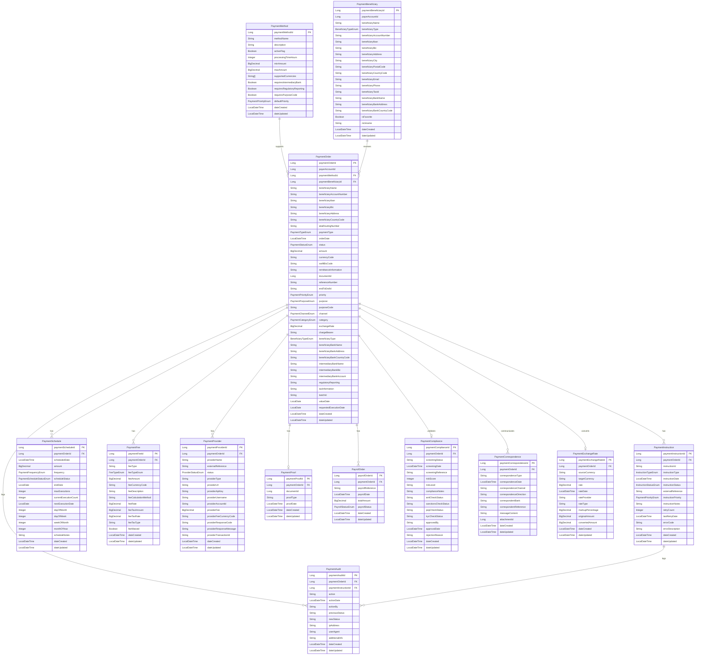

# Firefly Core Banking Payments Service

## Table of Contents
- [Overview](#overview)
- [Key Features](#key-features)
- [Architecture](#architecture)
  - [Service Architecture](#service-architecture)
  - [Platform Integration](#platform-integration)
- [Technical Stack](#technical-stack)
- [Data Model](#data-model)
  - [Entity Relationship Diagram](#entity-relationship-diagram)
  - [Payment Order](#payment-order)
  - [Payment Instruction](#payment-instruction)
  - [Payment Schedule](#payment-schedule)
  - [Payment Fee](#payment-fee)
  - [Payment Method](#payment-method)
  - [Payment Provider](#payment-provider)
  - [Payment Proof](#payment-proof)
  - [Payroll Order](#payroll-order)
  - [Payment Beneficiary](#payment-beneficiary)
  - [Payment Audit](#payment-audit)
  - [Payment Compliance](#payment-compliance)
  - [Payment Correspondence](#payment-correspondence)
  - [Payment Exchange Rate](#payment-exchange-rate)
- [API Reference](#api-reference)
  - [Payment Orders](#payment-orders)
  - [Payment Instructions](#payment-instructions)
  - [Payment Schedules](#payment-schedules)
  - [Payment Fees](#payment-fees)
  - [Payment Methods](#payment-methods)
  - [Payment Providers](#payment-providers)
  - [Payment Proofs](#payment-proofs)
  - [Payroll Orders](#payroll-orders)
  - [Payment Beneficiaries](#payment-beneficiaries)
  - [Payment Audit](#payment-audit)
  - [Payment Compliance](#payment-compliance)
  - [Payment Correspondence](#payment-correspondence)
  - [Payment Exchange Rates](#payment-exchange-rates)
- [Step-by-Step API Usage](#step-by-step-api-usage)
  - [Creating and Managing a Payment Order](#creating-and-managing-a-payment-order)
  - [Working with Payment Instructions](#working-with-payment-instructions)
  - [Setting Up Payment Schedules](#setting-up-payment-schedules)
  - [Managing Payment Providers](#managing-payment-providers)
  - [Managing Beneficiaries](#managing-beneficiaries)
  - [Working with Compliance](#working-with-compliance)
  - [Managing Exchange Rates](#managing-exchange-rates)
- [Getting Started](#getting-started)
  - [Prerequisites](#prerequisites)
  - [Building the Service](#building-the-service)
  - [Running Locally](#running-locally)
  - [Running with Docker](#running-with-docker)
  - [Running with the Platform](#running-with-the-platform)
- [Environment Configuration](#environment-configuration)
  - [Database Configuration](#database-configuration)
  - [Platform Integration](#platform-integration-1)
  - [Application Configuration](#application-configuration)
- [Development Guidelines](#development-guidelines)
  - [Code Structure](#code-structure)
  - [Coding Standards](#coding-standards)
  - [Platform Integration](#platform-integration-2)
- [Testing](#testing)
  - [Running Tests](#running-tests)
  - [Testing with Platform](#testing-with-platform)
- [Deployment](#deployment)
  - [Standalone Deployment](#standalone-deployment)
  - [Platform Deployment](#platform-deployment)
- [Contributing](#contributing)
- [License](#license)
- [Support](#support)

## Overview

The Firefly Core Banking Payments Service is a key microservice component of the Firefly Core Banking Platform that serves as a comprehensive repository manager for payment-related entities. It provides a robust API for creating, retrieving, updating, and deleting payment orders, instructions, schedules, fees, and other related entities in a banking environment.

As part of the Firefly Core Banking Platform, this service integrates seamlessly with other platform components such as accounts, customers, and general ledger services to provide a complete banking solution. Unlike previous versions that included simulation and execution functionality, this service now focuses exclusively on managing the repository of payment data, with payment operations handled by the Core Banking Payment Hub microservice. This separation of concerns improves maintainability and scalability of the overall platform.

## Key Features

- **Payment Order Management**: Create, retrieve, update, and delete payment orders that serve as the central entity for all payment operations
- **Payment Instruction Management**: Manage instructions that define how and when payments should be processed
- **Payment Schedule Management**: Configure one-time or recurring payment schedules
- **Payment Fee Management**: Define and manage fees associated with payment orders
- **Payment Method Management**: Configure and manage different payment methods supported by the system
- **Payment Provider Management**: Manage information about payment providers associated with payment orders
- **Payment Proof Management**: Store and retrieve proof of payment documentation
- **Payroll Order Management**: Manage payroll-specific payment orders
- **Comprehensive Filtering and Pagination**: All list endpoints support filtering and pagination for efficient data retrieval
- **Hierarchical Data Structure**: Entities are organized in a logical hierarchy with payment orders at the top level

## Architecture

### Service Architecture

The service follows a modular architecture with the following components:

1. **core-banking-payments-interfaces**: Contains DTOs (Data Transfer Objects), interfaces, and enums that define the API contract
2. **core-banking-payments-models**: Contains database entities and repositories for data persistence
3. **core-banking-payments-core**: Contains the business logic and service implementations
4. **core-banking-payments-web**: Contains REST controllers and web-related configurations

This architecture promotes separation of concerns, making the codebase more maintainable and testable.

### Platform Integration

As part of the Firefly Core Banking Platform, this service integrates with other platform components:

- **Core Banking Accounts**: For account validation and balance checks
- **Core Banking Customers**: For customer information and KYC verification
- **Core Banking General Ledger**: For accounting entries related to payments
- **Core Banking Payment Hub**: For payment execution and processing
- **Core Banking Security**: For authentication, authorization, and audit

The service communicates with these components through well-defined APIs, ensuring loose coupling and high cohesion within the platform.

## Technical Stack

- **Java 21**: Core programming language
- **Spring Boot**: Application framework
- **Spring WebFlux**: Reactive web framework
- **Spring Data R2DBC**: Reactive data access layer
- **PostgreSQL**: Relational database for data storage
- **Maven**: Dependency management and build tool
- **Docker**: Containerization
- **Swagger/OpenAPI**: API documentation
- **Lombok**: Reduces boilerplate code
- **Jackson**: JSON serialization/deserialization

## Data Model

### Entity Relationship Diagram



The service manages several interconnected entities that form a comprehensive payment data model:

### Payment Order

The central entity that represents a payment instruction from a payer to a beneficiary.

Key attributes:
- `paymentOrderId`: Unique identifier
- `payerAccountId`: Account from which the payment is made
- `paymentMethodId`: Method used for the payment
- `beneficiaryName`: Name of the payment recipient
- `beneficiaryAccountNumber`: Account number of the recipient
- `beneficiaryIban`: IBAN of the recipient
- `amount`: Payment amount
- `currencyCode`: Currency of the payment
- `paymentType`: Type of payment (SEPA_SCT, SWIFT, etc.)
- `status`: Current status of the payment order

### Payment Instruction

Represents a specific instruction for processing a payment order.

Key attributes:
- `paymentInstructionId`: Unique identifier
- `paymentOrderId`: Associated payment order
- `instructionType`: Type of instruction (IMMEDIATE, SCHEDULED)
- `instructionDate`: Date when the instruction was created
- `instructionStatus`: Current status of the instruction

### Payment Schedule

Defines when a payment should be executed, especially for recurring payments.

Key attributes:
- `paymentScheduleId`: Unique identifier
- `paymentOrderId`: Associated payment order
- `scheduledDate`: Date when the payment is scheduled
- `frequency`: Frequency of recurring payments
- `scheduleStatus`: Current status of the schedule

### Payment Fee

Represents fees associated with a payment order.

Key attributes:
- `paymentFeeId`: Unique identifier
- `paymentOrderId`: Associated payment order
- `feeType`: Type of fee
- `feeAmount`: Amount of the fee
- `feeCurrencyCode`: Currency of the fee

### Payment Method

Defines the available payment methods in the system.

Key attributes:
- `paymentMethodId`: Unique identifier
- `methodName`: Name of the payment method
- `description`: Description of the payment method
- `activeFlag`: Whether the method is active

### Payment Provider

Represents a provider that processes payments.

Key attributes:
- `paymentProviderId`: Unique identifier
- `paymentOrderId`: Associated payment order
- `providerName`: Name of the provider
- `externalReference`: External reference for the provider
- `status`: Current status of the provider

### Payment Proof

Stores proof of payment documentation.

Key attributes:
- `paymentProofId`: Unique identifier
- `paymentOrderId`: Associated payment order
- `documentId`: Reference to a document
- `proofType`: Type of proof
- `proofDate`: Date when the proof was created

### Payroll Order

Represents a payroll payment order.

Key attributes:
- `payrollOrderId`: Unique identifier
- `paymentOrderId`: Associated payment order
- `payrollReference`: Reference for the payroll
- `totalAmount`: Total amount of the payroll
- `payrollStatus`: Current status of the payroll

### Payment Beneficiary

Stores information about payment beneficiaries for reuse across multiple payment orders.

Key attributes:
- `paymentBeneficiaryId`: Unique identifier
- `payerAccountId`: Account that owns this beneficiary
- `beneficiaryName`: Name of the beneficiary
- `beneficiaryType`: Type of beneficiary (INDIVIDUAL, BUSINESS, GOVERNMENT)
- `beneficiaryIban`: IBAN of the beneficiary
- `beneficiaryBic`: BIC/SWIFT code of the beneficiary's bank
- `beneficiaryAddress`: Address of the beneficiary
- `beneficiaryBankName`: Name of the beneficiary's bank
- `isFavorite`: Whether this is a favorite beneficiary
- `nickname`: User-friendly name for the beneficiary

### Payment Audit

Tracks all changes to payment orders and instructions for audit purposes.

Key attributes:
- `paymentAuditId`: Unique identifier
- `paymentOrderId`: Associated payment order
- `paymentInstructionId`: Associated payment instruction (if applicable)
- `action`: Action performed (CREATE, UPDATE, DELETE, STATUS_CHANGE)
- `actionDate`: Date and time when the action was performed
- `actionBy`: User or system that performed the action
- `previousStatus`: Previous status (for status changes)
- `newStatus`: New status (for status changes)
- `additionalInfo`: Additional information about the action

### Payment Compliance

Stores compliance-related information for payment orders.

Key attributes:
- `paymentComplianceId`: Unique identifier
- `paymentOrderId`: Associated payment order
- `screeningStatus`: Status of compliance screening
- `riskScore`: Numeric risk score
- `riskLevel`: Risk level (LOW, MEDIUM, HIGH)
- `amlCheckStatus`: Anti-Money Laundering check status
- `sanctionsCheckStatus`: Sanctions check status
- `pepCheckStatus`: Politically Exposed Person check status
- `kycCheckStatus`: Know Your Customer check status
- `approvedBy`: User who approved the payment
- `rejectionReason`: Reason for rejection if applicable

### Payment Correspondence

Stores correspondence related to payment orders.

Key attributes:
- `paymentCorrespondenceId`: Unique identifier
- `paymentOrderId`: Associated payment order
- `correspondenceType`: Type of correspondence
- `correspondenceDate`: Date of the correspondence
- `correspondenceDirection`: Direction (INBOUND or OUTBOUND)
- `correspondentBank`: Name of the correspondent bank
- `messageContent`: Content of the correspondence

### Payment Exchange Rate

Stores exchange rate information for cross-currency payments.

Key attributes:
- `paymentExchangeRateId`: Unique identifier
- `paymentOrderId`: Associated payment order
- `sourceCurrency`: Source currency code
- `targetCurrency`: Target currency code
- `rate`: Exchange rate
- `rateDate`: Date when the rate was obtained
- `rateProvider`: Provider of the exchange rate
- `originalAmount`: Original amount in source currency
- `convertedAmount`: Converted amount in target currency

## API Reference

The service exposes a RESTful API with the following endpoints:

### Payment Orders

- `GET /api/v1/payment-orders`: List payment orders with filtering and pagination
- `POST /api/v1/payment-orders`: Create a new payment order
- `GET /api/v1/payment-orders/{paymentOrderId}`: Get a specific payment order
- `PUT /api/v1/payment-orders/{paymentOrderId}`: Update a payment order
- `DELETE /api/v1/payment-orders/{paymentOrderId}`: Delete a payment order

### Payment Instructions

- `GET /api/v1/payment-orders/{paymentOrderId}/instructions`: List instructions for a payment order
- `POST /api/v1/payment-orders/{paymentOrderId}/instructions`: Create a new instruction
- `GET /api/v1/payment-orders/{paymentOrderId}/instructions/{paymentInstructionId}`: Get a specific instruction
- `PUT /api/v1/payment-orders/{paymentOrderId}/instructions/{paymentInstructionId}`: Update an instruction
- `DELETE /api/v1/payment-orders/{paymentOrderId}/instructions/{paymentInstructionId}`: Delete an instruction

### Payment Schedules

- `GET /api/v1/payment-orders/{paymentOrderId}/schedules`: List schedules for a payment order
- `POST /api/v1/payment-orders/{paymentOrderId}/schedules`: Create a new schedule
- `GET /api/v1/payment-orders/{paymentOrderId}/schedules/{paymentScheduleId}`: Get a specific schedule
- `PUT /api/v1/payment-orders/{paymentOrderId}/schedules/{paymentScheduleId}`: Update a schedule
- `DELETE /api/v1/payment-orders/{paymentOrderId}/schedules/{paymentScheduleId}`: Delete a schedule

### Payment Fees

- `GET /api/v1/payment-orders/{paymentOrderId}/fees`: List fees for a payment order
- `POST /api/v1/payment-orders/{paymentOrderId}/fees`: Create a new fee
- `GET /api/v1/payment-orders/{paymentOrderId}/fees/{paymentFeeId}`: Get a specific fee
- `PUT /api/v1/payment-orders/{paymentOrderId}/fees/{paymentFeeId}`: Update a fee
- `DELETE /api/v1/payment-orders/{paymentOrderId}/fees/{paymentFeeId}`: Delete a fee

### Payment Methods

- `GET /api/v1/payment-methods`: List payment methods
- `POST /api/v1/payment-methods`: Create a new payment method
- `GET /api/v1/payment-methods/{paymentMethodId}`: Get a specific payment method
- `PUT /api/v1/payment-methods/{paymentMethodId}`: Update a payment method
- `DELETE /api/v1/payment-methods/{paymentMethodId}`: Delete a payment method

### Payment Providers

- `GET /api/v1/payment-orders/{paymentOrderId}/providers`: List providers for a payment order
- `POST /api/v1/payment-orders/{paymentOrderId}/providers`: Create a new provider
- `GET /api/v1/payment-orders/{paymentOrderId}/providers/{paymentProviderId}`: Get a specific provider
- `PUT /api/v1/payment-orders/{paymentOrderId}/providers/{paymentProviderId}`: Update a provider
- `DELETE /api/v1/payment-orders/{paymentOrderId}/providers/{paymentProviderId}`: Delete a provider

### Payment Proofs

- `GET /api/v1/payment-orders/{paymentOrderId}/proof`: List proofs for a payment order
- `POST /api/v1/payment-orders/{paymentOrderId}/proof`: Create a new proof
- `GET /api/v1/payment-orders/{paymentOrderId}/proof/{paymentProofId}`: Get a specific proof
- `PUT /api/v1/payment-orders/{paymentOrderId}/proof/{paymentProofId}`: Update a proof
- `DELETE /api/v1/payment-orders/{paymentOrderId}/proof/{paymentProofId}`: Delete a proof

### Payroll Orders

- `GET /api/v1/payment-orders/{paymentOrderId}/payroll-orders`: List payroll orders for a payment order
- `POST /api/v1/payment-orders/{paymentOrderId}/payroll-orders`: Create a new payroll order
- `GET /api/v1/payment-orders/{paymentOrderId}/payroll-orders/{payrollOrderId}`: Get a specific payroll order
- `PUT /api/v1/payment-orders/{paymentOrderId}/payroll-orders/{payrollOrderId}`: Update a payroll order
- `DELETE /api/v1/payment-orders/{paymentOrderId}/payroll-orders/{payrollOrderId}`: Delete a payroll order

### Payment Beneficiaries

- `GET /api/v1/payment-beneficiaries`: List all beneficiaries
- `GET /api/v1/payment-beneficiaries?payerAccountId={payerAccountId}`: List beneficiaries for a specific payer account
- `GET /api/v1/payment-beneficiaries?payerAccountId={payerAccountId}&isFavorite=true`: List favorite beneficiaries
- `POST /api/v1/payment-beneficiaries`: Create a new beneficiary
- `GET /api/v1/payment-beneficiaries/{paymentBeneficiaryId}`: Get a specific beneficiary
- `PUT /api/v1/payment-beneficiaries/{paymentBeneficiaryId}`: Update a beneficiary
- `DELETE /api/v1/payment-beneficiaries/{paymentBeneficiaryId}`: Delete a beneficiary
- `PUT /api/v1/payment-beneficiaries/{paymentBeneficiaryId}/favorite`: Mark a beneficiary as favorite

### Payment Audit

- `GET /api/v1/payment-orders/{paymentOrderId}/audit`: List audit records for a payment order
- `GET /api/v1/payment-orders/{paymentOrderId}/instructions/{paymentInstructionId}/audit`: List audit records for a payment instruction

### Payment Compliance

- `GET /api/v1/payment-orders/{paymentOrderId}/compliance`: Get compliance information for a payment order
- `POST /api/v1/payment-orders/{paymentOrderId}/compliance`: Create or update compliance information
- `PUT /api/v1/payment-orders/{paymentOrderId}/compliance/approve`: Approve a payment from compliance perspective
- `PUT /api/v1/payment-orders/{paymentOrderId}/compliance/reject`: Reject a payment from compliance perspective

### Payment Correspondence

- `GET /api/v1/payment-orders/{paymentOrderId}/correspondence`: List correspondence for a payment order
- `POST /api/v1/payment-orders/{paymentOrderId}/correspondence`: Add new correspondence
- `GET /api/v1/payment-orders/{paymentOrderId}/correspondence/{paymentCorrespondenceId}`: Get specific correspondence

### Payment Exchange Rates

- `GET /api/v1/payment-orders/{paymentOrderId}/exchange-rates`: Get exchange rate information for a payment order
- `POST /api/v1/payment-orders/{paymentOrderId}/exchange-rates`: Add exchange rate information
- `GET /api/v1/exchange-rates`: Get current exchange rates
- `GET /api/v1/exchange-rates?sourceCurrency={sourceCurrency}&targetCurrency={targetCurrency}`: Get specific exchange rate

## Step-by-Step API Usage

This section provides detailed examples of how to use the API for common payment management scenarios.

### Creating and Managing a Payment Order

1. **Create a Payment Method** (if not already available):
   ```http
   POST /api/v1/payment-methods
   Content-Type: application/json

   {
     "methodName": "SEPA_SCT",
     "description": "SEPA Credit Transfer",
     "activeFlag": true,
     "processingTimeHours": 24,
     "minAmount": 0.01,
     "maxAmount": 100000.00,
     "supportedCurrencies": ["EUR"],
     "requiresIntermediaryBank": false,
     "requiresRegulatoryReporting": false,
     "requiresPurposeCode": false,
     "defaultPriority": "NORMAL"
   }
   ```

2. **Create a Payment Order**:
   ```http
   POST /api/v1/payment-orders
   Content-Type: application/json

   {
     "payerAccountId": 12345,
     "paymentMethodId": 1,
     "beneficiaryName": "John Doe",
     "beneficiaryIban": "ES9121000418450200051332",
     "beneficiaryBic": "CAIXESBBXXX",
     "paymentType": "SEPA_SCT",
     "amount": 1000.00,
     "currencyCode": "EUR",
     "remittanceInformation": "Invoice payment #INV-2023-001",
     "priority": "NORMAL",
     "purpose": "INVOICE_PAYMENT",
     "channel": "ONLINE_BANKING",
     "category": "DOMESTIC",
     "referenceNumber": "REF-2023-001",
     "endToEndId": "E2E-2023-001",
     "valueDate": "2023-12-01"
   }
   ```

3. **Retrieve the Payment Order**:
   ```http
   GET /api/v1/payment-orders/1
   ```

4. **Update the Payment Order**:
   ```http
   PUT /api/v1/payment-orders/1
   Content-Type: application/json

   {
     "payerAccountId": 12345,
     "paymentMethodId": 1,
     "beneficiaryName": "John Doe",
     "beneficiaryIban": "ES9121000418450200051332",
     "beneficiaryBic": "CAIXESBBXXX",
     "paymentType": "SEPA_SCT",
     "amount": 1500.00,
     "currencyCode": "EUR",
     "remittanceInformation": "Updated invoice payment #INV-2023-001",
     "priority": "HIGH",
     "purpose": "INVOICE_PAYMENT",
     "channel": "ONLINE_BANKING",
     "category": "DOMESTIC",
     "referenceNumber": "REF-2023-001-UPDATED",
     "endToEndId": "E2E-2023-001",
     "valueDate": "2023-12-01"
   }
   ```

5. **List Payment Orders with Filtering**:
   ```http
   GET /api/v1/payment-orders?page=0&size=10&sort=orderDate,desc&payerAccountId=12345
   ```

### Working with Payment Instructions

1. **Create a Payment Instruction for a Payment Order**:
   ```http
   POST /api/v1/payment-orders/1/instructions
   Content-Type: application/json

   {
     "instructionType": "IMMEDIATE",
     "instructionStatus": "PENDING",
     "instructionPriority": "NORMAL",
     "externalReference": "EXT-REF-001",
     "instructionNotes": "Process immediately"
   }
   ```

2. **Retrieve Payment Instructions for a Payment Order**:
   ```http
   GET /api/v1/payment-orders/1/instructions
   ```

3. **Update a Payment Instruction**:
   ```http
   PUT /api/v1/payment-orders/1/instructions/1
   Content-Type: application/json

   {
     "instructionType": "IMMEDIATE",
     "instructionStatus": "EXECUTED",
     "instructionPriority": "HIGH",
     "externalReference": "EXT-REF-001-UPDATED",
     "instructionNotes": "Processed successfully"
   }
   ```

### Setting Up Payment Schedules

1. **Create a Payment Schedule for a Payment Order**:
   ```http
   POST /api/v1/payment-orders/1/schedules
   Content-Type: application/json

   {
     "scheduledDate": "2023-12-01T10:00:00",
     "amount": 1000.00,
     "frequency": "MONTHLY",
     "scheduleStatus": "SCHEDULED",
     "endDate": "2024-12-01",
     "maxExecutions": 12,
     "dayOfMonth": 1,
     "scheduleNotes": "Monthly payment for 1 year"
   }
   ```

2. **Retrieve Payment Schedules for a Payment Order**:
   ```http
   GET /api/v1/payment-orders/1/schedules
   ```

3. **Update a Payment Schedule**:
   ```http
   PUT /api/v1/payment-orders/1/schedules/1
   Content-Type: application/json

   {
     "scheduledDate": "2023-12-15T10:00:00",
     "amount": 1000.00,
     "frequency": "MONTHLY",
     "scheduleStatus": "SCHEDULED",
     "endDate": "2024-12-15",
     "maxExecutions": 12,
     "dayOfMonth": 15,
     "scheduleNotes": "Updated monthly payment for 1 year"
   }
   ```

### Managing Payment Providers

1. **Add a Payment Provider to a Payment Order**:
   ```http
   POST /api/v1/payment-orders/1/providers
   Content-Type: application/json

   {
     "providerName": "BBVA",
     "externalReference": "BBVA-REF-12345",
     "status": "ACTIVE",
     "providerType": "BANK",
     "providerUrl": "https://api.bbva.com",
     "providerApiKey": "api-key-12345",
     "providerUsername": "bbva-api-user",
     "providerAccountId": "BBVA-ACCOUNT-001",
     "providerFee": 1.50,
     "providerFeeCurrencyCode": "EUR"
   }
   ```

2. **Retrieve Payment Providers for a Payment Order**:
   ```http
   GET /api/v1/payment-orders/1/providers
   ```

3. **Update a Payment Provider**:
   ```http
   PUT /api/v1/payment-orders/1/providers/1
   Content-Type: application/json

   {
     "providerName": "BBVA",
     "externalReference": "BBVA-REF-67890",
     "status": "ACTIVE",
     "providerType": "BANK",
     "providerUrl": "https://api.bbva.com",
     "providerApiKey": "api-key-12345",
     "providerUsername": "bbva-api-user",
     "providerAccountId": "BBVA-ACCOUNT-001",
     "providerFee": 1.50,
     "providerFeeCurrencyCode": "EUR",
     "providerResponseCode": "SUCCESS",
     "providerResponseMessage": "Payment processed successfully",
     "providerTransactionId": "BBVA-TX-12345"
   }
   ```

### Managing Beneficiaries

1. **Create a New Beneficiary**:
   ```http
   POST /api/v1/payment-beneficiaries
   Content-Type: application/json

   {
     "payerAccountId": 12345,
     "beneficiaryName": "John Doe Ltd",
     "beneficiaryType": "BUSINESS",
     "beneficiaryAccountNumber": "12345678",
     "beneficiaryIban": "ES9121000418450200051332",
     "beneficiaryBic": "CAIXESBBXXX",
     "beneficiaryAddress": "123 Business St, Barcelona",
     "beneficiaryCity": "Barcelona",
     "beneficiaryPostalCode": "08001",
     "beneficiaryCountryCode": "ES",
     "beneficiaryEmail": "accounts@johndoeltd.com",
     "beneficiaryPhone": "+34612345678",
     "beneficiaryTaxId": "B12345678",
     "beneficiaryBankName": "CaixaBank",
     "beneficiaryBankAddress": "456 Bank St, Barcelona",
     "beneficiaryBankCountryCode": "ES",
     "isFavorite": true,
     "nickname": "John's Company"
   }
   ```

2. **List Favorite Beneficiaries**:
   ```http
   GET /api/v1/payment-beneficiaries?payerAccountId=12345&isFavorite=true
   ```

3. **Use a Beneficiary in a Payment Order**:
   ```http
   POST /api/v1/payment-orders
   Content-Type: application/json

   {
     "payerAccountId": 12345,
     "paymentMethodId": 1,
     "paymentBeneficiaryId": 1,
     "paymentType": "SEPA_SCT",
     "amount": 1000.00,
     "currencyCode": "EUR",
     "remittanceInformation": "Invoice payment #INV-2023-001",
     "priority": "NORMAL",
     "purpose": "INVOICE_PAYMENT",
     "channel": "ONLINE_BANKING",
     "category": "DOMESTIC",
     "referenceNumber": "REF-2023-001",
     "endToEndId": "E2E-2023-001",
     "valueDate": "2023-12-01"
   }
   ```

### Working with Compliance

1. **Check Compliance Status for a Payment Order**:
   ```http
   GET /api/v1/payment-orders/1/compliance
   ```

2. **Update Compliance Information**:
   ```http
   POST /api/v1/payment-orders/1/compliance
   Content-Type: application/json

   {
     "paymentOrderId": 1,
     "screeningStatus": "COMPLETED",
     "screeningDate": "2023-12-01T10:00:00",
     "screeningReference": "SCR-2023-001",
     "riskScore": 25,
     "riskLevel": "LOW",
     "complianceNotes": "All checks completed successfully",
     "amlCheckStatus": "PASSED",
     "sanctionsCheckStatus": "PASSED",
     "pepCheckStatus": "PASSED",
     "kycCheckStatus": "PASSED"
   }
   ```

3. **Approve a Payment from Compliance Perspective**:
   ```http
   PUT /api/v1/payment-orders/1/compliance/approve
   Content-Type: application/json

   {
     "approvedBy": "compliance.officer",
     "complianceNotes": "All checks passed. Payment approved."
   }
   ```

### Managing Exchange Rates

1. **Get Current Exchange Rate**:
   ```http
   GET /api/v1/exchange-rates?sourceCurrency=USD&targetCurrency=EUR
   ```

2. **Add Exchange Rate Information to a Payment Order**:
   ```http
   POST /api/v1/payment-orders/1/exchange-rates
   Content-Type: application/json

   {
     "paymentOrderId": 1,
     "sourceCurrency": "USD",
     "targetCurrency": "EUR",
     "rate": 0.92,
     "rateDate": "2023-12-01T10:00:00",
     "rateProvider": "ECB",
     "rateType": "SPOT",
     "markupPercentage": 1.5,
     "originalAmount": 1000.00,
     "convertedAmount": 920.00
   }
   ```

3. **View Exchange Rate Information for a Payment Order**:
   ```http
   GET /api/v1/payment-orders/1/exchange-rates
   ```

## Getting Started

### Prerequisites

- Java Development Kit (JDK) 21
- Maven 3.8+
- Docker (for containerized deployment)
- PostgreSQL database
- Access to other Firefly Core Banking Platform services (for full functionality)

### Building the Service

```bash
mvn clean install
```

### Running Locally

```bash
mvn spring-boot:run -pl core-banking-payments-web
```

### Running with Docker

```bash
# Build the Docker image
docker build -t firefly/core-banking-payments .

# Run the container
docker run -p 8080:8080 firefly/core-banking-payments
```

### Running with the Platform

For full functionality, this service should be run as part of the complete Firefly Core Banking Platform. Refer to the platform documentation for instructions on deploying the entire platform using Docker Compose or Kubernetes.

## Environment Configuration

The following environment variables can be configured:

### Database Configuration
- `SPRING_PROFILES_ACTIVE`: Active Spring profile (dev, test, prod)
- `SPRING_R2DBC_URL`: Database connection URL
- `SPRING_R2DBC_USERNAME`: Database username
- `SPRING_R2DBC_PASSWORD`: Database password

### Platform Integration
- `FIREFLY_ACCOUNTS_SERVICE_URL`: URL of the Firefly Core Banking Accounts service
- `FIREFLY_CUSTOMERS_SERVICE_URL`: URL of the Firefly Core Banking Customers service
- `FIREFLY_GL_SERVICE_URL`: URL of the Firefly Core Banking General Ledger service
- `FIREFLY_PAYMENT_HUB_SERVICE_URL`: URL of the Firefly Core Banking Payment Hub service
- `FIREFLY_SECURITY_SERVICE_URL`: URL of the Firefly Core Banking Security service

### Application Configuration
- `SERVER_PORT`: Port on which the service runs (default: 8080)
- `LOGGING_LEVEL_ROOT`: Root logging level
- `LOGGING_LEVEL_COM_CATALIS`: Application-specific logging level

## Development Guidelines

### Code Structure

- Follow the package structure based on domain concepts
- Use DTOs for API request/response objects
- Implement business logic in service classes
- Use repositories for data access
- Follow the Firefly Core Banking Platform architectural guidelines

### Coding Standards

- Follow Java coding conventions
- Use meaningful variable and method names
- Write comprehensive JavaDoc comments
- Include unit tests for all new functionality
- Adhere to the Firefly Core Banking Platform coding standards

### Platform Integration

- Use the standard Firefly Core Banking Platform integration patterns
- Implement proper error handling for cross-service communication
- Use circuit breakers for resilience in service-to-service communication
- Follow the platform's event-driven architecture guidelines when applicable

## Testing

### Running Tests

```bash
# Run all tests
mvn test

# Run specific test class
mvn test -Dtest=PaymentOrderServiceTest

# Run integration tests
mvn verify -P integration-test
```

### Testing with Platform

For comprehensive testing with other Firefly Core Banking Platform components:

```bash
# Run platform integration tests
mvn verify -P platform-integration-test
```

This requires access to the Firefly Core Banking Platform test environment.

## Deployment

### Standalone Deployment

The service can be deployed as a standalone Spring Boot application or as a Docker container. It exposes port 8080 for HTTP traffic.

### Platform Deployment

For production use, deploy this service as part of the complete Firefly Core Banking Platform using the platform's deployment tools:

- **Docker Compose**: For development and testing environments
- **Kubernetes**: For production environments using the provided Helm charts
- **Firefly Platform Manager**: For managed deployments

## Contributing

1. Fork the repository
2. Create a feature branch (`git checkout -b feature/your-feature`)
3. Commit your changes (`git commit -m 'Add some feature'`)
4. Push to the branch (`git push origin feature/your-feature`)
5. Create a new Pull Request

## License

This project is under the Apache 2.0 - LICENSE.

## Support

For support with this service or the Firefly Core Banking Platform:

- **Documentation**: Refer to the complete Firefly Core Banking Platform documentation
- **Support Portal**: Submit tickets through the Firefly support portal
- **Community Forum**: Participate in the Firefly Core Banking Platform community forum
- **Training**: Access training materials through the Firefly Learning Center