# Firefly Core Banking Payments Service

A comprehensive payment repository management microservice that serves as the central data hub for all payment-related operations within the Firefly OpenCore Banking Platform.

## Table of Contents
- [Overview](#overview)
- [Key Features](#key-features)
- [Architecture](#architecture)
  - [Service Architecture](#service-architecture)
  - [Platform Integration](#platform-integration)
  - [Technical Stack](#technical-stack)
- [Data Model](#data-model)
  - [Entity Relationship Diagram](#entity-relationship-diagram)
  - [Core Entities](#core-entities)
- [Installation](#installation)
  - [Prerequisites](#prerequisites)
  - [Building the Service](#building-the-service)
  - [Running Locally](#running-locally)
  - [Docker Deployment](#docker-deployment)
- [API Documentation](#api-documentation)
  - [Payment Orders API](#payment-orders-api)
  - [Payment Methods API](#payment-methods-api)
  - [Payment Schedules API](#payment-schedules-api)
  - [Payment Fees API](#payment-fees-api)
  - [Other APIs](#other-apis)
- [Usage Examples](#usage-examples)
- [Contributing](#contributing)
- [License](#license)
- [Support](#support)

## Overview

The **Firefly Core Banking Payments Service** is a critical microservice component of the Firefly OpenCore Banking Platform, developed by **Firefly Software Solutions Inc**. This service serves as the central repository manager for all payment-related entities, providing a robust and scalable API for managing payment orders, instructions, schedules, fees, and associated data in modern banking environments.

### Purpose

This microservice focuses exclusively on **data management and repository operations** for payment entities, following a clear separation of concerns architecture. While payment processing and execution are handled by the Core Banking Payment Hub microservice, this service ensures reliable storage, retrieval, and management of payment data with comprehensive audit trails and compliance tracking.

### Supported Payment Types

The service supports a wide range of payment operations including:

- **SEPA Credit Transfers (SCT)** - Standard European payments
- **SEPA Instant Credit Transfers (ICT)** - Real-time European payments
- **SEPA Direct Debits (DD)** - Automated debit collections
- **SWIFT International Transfers** - Global wire transfers
- **Internal Transfers** - Domestic account-to-account transfers
- **Payroll Payments** - Bulk salary and wage distributions

### Platform Integration

As part of the Firefly OpenCore Banking Platform, this service integrates seamlessly with other platform components including accounts management, customer services, and general ledger systems to provide a complete banking solution. The service is designed for high availability, scalability, and regulatory compliance in production banking environments.

## Key Features

- **Comprehensive Payment Order Management** - Full CRUD operations for payment orders with support for multiple payment types
- **Advanced Payment Scheduling** - Flexible recurring payment schedules with frequency controls and execution limits
- **Multi-Currency Support** - Handle payments in multiple currencies with exchange rate management
- **Fee Management System** - Configurable fee structures with tax calculations and waiver capabilities
- **Payment Method Configuration** - Support for various payment methods with validation rules and processing parameters
- **Beneficiary Management** - Centralized beneficiary registry with favorites and detailed banking information
- **Audit Trail & Compliance** - Complete audit logging and compliance validation for regulatory requirements
- **Provider Integration** - Manage multiple payment providers with external reference tracking
- **Proof of Payment** - Document management for payment confirmations and receipts
- **Reactive Architecture** - Built with Spring WebFlux for high-performance, non-blocking operations
- **Advanced Filtering & Pagination** - Sophisticated query capabilities across all entities
- **OpenAPI Documentation** - Complete API documentation with Swagger UI integration

## Architecture

### Service Architecture

The service follows a clean, modular architecture with clear separation of concerns across multiple Maven modules:

1. **core-banking-payments-interfaces** - API contracts, DTOs, and enums
2. **core-banking-payments-models** - Database entities, repositories, and data access layer
3. **core-banking-payments-core** - Business logic, service implementations, and mappers
4. **core-banking-payments-web** - REST controllers, configuration, and web layer
5. **core-banking-payments-sdk** - Client SDK for external integrations

This modular approach ensures maintainability, testability, and enables independent deployment of components.

### Technical Stack

- **Java 21** - Latest LTS version with virtual threads support
- **Spring Boot 3.x** - Modern Spring framework with reactive programming
- **Spring WebFlux** - Reactive web framework for high-performance APIs
- **Spring Data R2DBC** - Reactive database access with PostgreSQL
- **PostgreSQL** - Primary database with advanced JSON and UUID support
- **Flyway** - Database migration and version control
- **Maven** - Build automation and dependency management
- **OpenAPI 3** - API documentation with Swagger UI
- **Docker** - Containerization for deployment

### Platform Integration

As a core component of the Firefly OpenCore Banking Platform, this service integrates with:

- **Core Banking Accounts** - Account validation and balance verification
- **Core Banking Customers** - Customer data and KYC information
- **Core Banking General Ledger** - Accounting entries and financial reporting
- **Core Banking Payment Hub** - Payment processing and execution
- **Core Banking Security** - Authentication, authorization, and audit trails
- **Document Management** - Payment receipts and compliance documentation

## Technical Stack

- **Java 21**: Core programming language
- **Spring Boot**: Application framework
- **Spring WebFlux**: Reactive web framework
- **Spring Data R2DBC**: Reactive data access layer
- **PostgreSQL**: Relational database for data storage
- **Maven**: Dependency management and build tool
- **Docker**: Containerization
- **Swagger/OpenAPI**: API documentation
- **Lombok**: Reduces boilerplate code
- **Jackson**: JSON serialization/deserialization

## Data Model

### Entity Relationship Diagram

```mermaid
erDiagram
    PaymentMethod ||--o{ PaymentOrder : "supports"
    PaymentBeneficiary ||--o{ PaymentOrder : "receives"
    PaymentOrder ||--o{ PaymentInstruction : "has"
    PaymentOrder ||--o{ PaymentSchedule : "schedules"
    PaymentOrder ||--o{ PaymentFee : "charges"
    PaymentOrder ||--o{ PaymentProvider : "processes"
    PaymentOrder ||--o| PaymentProof : "proves"
    PaymentOrder ||--o{ PayrollOrder : "includes"
    PaymentOrder ||--o{ PaymentAudit : "audits"
    PaymentOrder ||--o| PaymentCompliance : "validates"
    PaymentOrder ||--o{ PaymentCorrespondence : "communicates"
    PaymentOrder ||--o| PaymentExchangeRate : "converts"

    PaymentMethod {
        UUID paymentMethodId PK
        String methodName
        String description
        Boolean activeFlag
        Integer processingTimeHours
        BigDecimal minAmount
        BigDecimal maxAmount
        String[] supportedCurrencies
        Boolean requiresIntermediaryBank
        Boolean requiresRegulatoryReporting
        Boolean requiresPurposeCode
        PaymentPriorityEnum defaultPriority
        LocalDateTime dateCreated
        LocalDateTime dateUpdated
    }

    PaymentBeneficiary {
        UUID paymentBeneficiaryId PK
        UUID payerAccountId
        String beneficiaryName
        BeneficiaryTypeEnum beneficiaryType
        String beneficiaryAccountNumber
        String beneficiaryIban
        String beneficiaryBic
        String beneficiaryAddress
        String beneficiaryCity
        String beneficiaryPostalCode
        String beneficiaryCountryCode
        String beneficiaryEmail
        String beneficiaryPhone
        String beneficiaryTaxId
        String beneficiaryBankName
        String beneficiaryBankAddress
        String beneficiaryBankCountryCode
        Boolean isFavorite
        String nickname
        LocalDateTime dateCreated
        LocalDateTime dateUpdated
    }

    PaymentOrder {
        UUID paymentOrderId PK
        UUID payerAccountId
        UUID paymentMethodId FK
        UUID paymentBeneficiaryId FK
        String beneficiaryName
        String beneficiaryAccountNumber
        String beneficiaryIban
        String beneficiaryBic
        String beneficiaryAddress
        String beneficiaryCountryCode
        String abaRoutingNumber
        PaymentTypeEnum paymentType
        LocalDateTime orderDate
        PaymentStatusEnum status
        BigDecimal amount
        String currencyCode
        String swiftBicCode
        String remittanceInformation
        UUID documentId
        String referenceNumber
        String endToEndId
        PaymentPriorityEnum priority
        PaymentPurposeEnum purpose
        String purposeCode
        PaymentChannelEnum channel
        PaymentCategoryEnum category
        BigDecimal exchangeRate
        String chargeBearer
        String intermediaryBankName
        String intermediaryBankBic
        String intermediaryBankAccount
        String regulatoryReporting
        String taxInformation
        String batchId
        LocalDate valueDate
        LocalDate requestedExecutionDate
        LocalDateTime dateCreated
        LocalDateTime dateUpdated
    }

    PaymentInstruction {
        UUID paymentInstructionId PK
        UUID paymentOrderId FK
        String instructionId
        InstructionTypeEnum instructionType
        LocalDateTime instructionDate
        PaymentStatusEnum instructionStatus
        String externalReference
        PaymentPriorityEnum instructionPriority
        String instructionNotes
        Integer retryCount
        LocalDateTime lastRetryDate
        String errorCode
        String errorDescription
        LocalDateTime dateCreated
        LocalDateTime dateUpdated
    }

    PaymentSchedule {
        UUID paymentScheduleId PK
        UUID paymentOrderId FK
        LocalDateTime scheduledDate
        BigDecimal amount
        PaymentFrequencyEnum frequency
        PaymentScheduleStatusEnum scheduleStatus
        LocalDate endDate
        Integer maxExecutions
        Integer currentExecutionCount
        LocalDate nextExecutionDate
        Integer dayOfMonth
        Integer dayOfWeek
        Integer weekOfMonth
        Integer monthOfYear
        String scheduleNotes
        LocalDateTime dateCreated
        LocalDateTime dateUpdated
    }

    PaymentFee {
        UUID paymentFeeId PK
        UUID paymentOrderId FK
        String feeType
        FeeTypeEnum feeTypeEnum
        BigDecimal feeAmount
        String feeCurrencyCode
        String feeDescription
        String feeCalculationMethod
        BigDecimal feeRate
        BigDecimal feeTaxAmount
        BigDecimal feeTaxRate
        String feeTaxType
        Boolean feeWaived
        LocalDateTime dateCreated
        LocalDateTime dateUpdated
    }

    PaymentProvider {
        UUID paymentProviderId PK
        UUID paymentOrderId FK
        String providerName
        String externalReference
        ProviderStatusEnum status
        String providerType
        String providerUrl
        String providerApiKey
        String providerUsername
        String providerAccountId
        BigDecimal providerFee
        String providerFeeCurrencyCode
        String providerResponseCode
        String providerResponseMessage
        String providerTransactionId
        LocalDateTime dateCreated
        LocalDateTime dateUpdated
    }

    PaymentProof {
        UUID paymentProofId PK
        UUID paymentOrderId FK
        UUID documentId
        String proofType
        LocalDateTime proofDate
        LocalDateTime dateCreated
        LocalDateTime dateUpdated
    }

    PayrollOrder {
        UUID payrollOrderId PK
        UUID paymentOrderId FK
        String payrollReference
        LocalDateTime payrollDate
        BigDecimal totalAmount
        PayrollStatusEnum payrollStatus
        LocalDateTime dateCreated
        LocalDateTime dateUpdated
    }

    PaymentAudit {
        UUID paymentAuditId PK
        UUID paymentOrderId FK
        UUID paymentInstructionId FK
        String action
        LocalDateTime actionDate
        String actionBy
        String previousStatus
        String newStatus
        String ipAddress
        String userAgent
        String additionalInfo
        LocalDateTime dateCreated
        LocalDateTime dateUpdated
    }

    PaymentCompliance {
        UUID paymentComplianceId PK
        UUID paymentOrderId FK
        String screeningStatus
        LocalDateTime screeningDate
        String screeningReference
        Integer riskScore
        String riskLevel
        String complianceNotes
        String amlCheckStatus
        String sanctionsCheckStatus
        String pepCheckStatus
        String kycCheckStatus
        String approvedBy
        LocalDateTime approvalDate
        String rejectionReason
        LocalDateTime dateCreated
        LocalDateTime dateUpdated
    }

    PaymentCorrespondence {
        UUID paymentCorrespondenceId PK
        UUID paymentOrderId FK
        String correspondenceType
        LocalDateTime correspondenceDate
        String correspondenceChannel
        String correspondenceDirection
        String correspondentBank
        String correspondentReference
        String messageContent
        UUID attachmentId
        LocalDateTime dateCreated
        LocalDateTime dateUpdated
    }

    PaymentExchangeRate {
        UUID paymentExchangeRateId PK
        UUID paymentOrderId FK
        String sourceCurrency
        String targetCurrency
        BigDecimal rate
        LocalDateTime rateDate
        String rateProvider
        String rateType
        BigDecimal markupPercentage
        BigDecimal originalAmount
        BigDecimal convertedAmount
        LocalDateTime dateCreated
        LocalDateTime dateUpdated
    }
```


### Core Entities

The service manages several interconnected entities that form a comprehensive payment data model:

#### PaymentOrder
The central entity representing a payment instruction from a payer to a beneficiary. Contains all essential payment details including amounts, currencies, beneficiary information, and processing metadata.

**Key Attributes:**
- `paymentOrderId` - Unique identifier (UUID)
- `payerAccountId` - Account from which the payment is made
- `paymentMethodId` - Method used for the payment
- `beneficiaryName` - Name of the payment recipient
- `amount` - Payment amount
- `currencyCode` - Currency of the payment
- `paymentType` - Type of payment (SEPA_SCT, SWIFT, etc.)
- `status` - Current status of the payment order

#### PaymentMethod
Defines the available payment methods (SEPA SCT, SWIFT, etc.) with their processing characteristics, limits, and requirements.

**Key Attributes:**
- `paymentMethodId` - Unique identifier (UUID)
- `methodName` - Name of the payment method
- `description` - Description of the payment method
- `activeFlag` - Whether the method is active
- `processingTimeHours` - Expected processing time
- `minAmount` / `maxAmount` - Transaction limits
- `supportedCurrencies` - Array of supported currencies

#### PaymentBeneficiary
Centralized registry of payment recipients with detailed banking information, contact details, and user preferences like favorites and nicknames.

**Key Attributes:**
- `paymentBeneficiaryId` - Unique identifier (UUID)
- `payerAccountId` - Account that owns this beneficiary
- `beneficiaryName` - Name of the beneficiary
- `beneficiaryType` - Type (INDIVIDUAL, BUSINESS, GOVERNMENT)
- `beneficiaryIban` - IBAN of the beneficiary
- `beneficiaryBic` - BIC/SWIFT code
- `isFavorite` - Whether this is a favorite beneficiary
- `nickname` - User-friendly name

#### PaymentInstruction
Specific processing instructions for payment orders, including retry logic, error handling, and external system references.

**Key Attributes:**
- `paymentInstructionId` - Unique identifier (UUID)
- `paymentOrderId` - Associated payment order
- `instructionType` - Type of instruction
- `instructionStatus` - Current status
- `retryCount` - Number of retry attempts
- `errorCode` / `errorDescription` - Error handling information

#### PaymentSchedule
Manages recurring payment schedules with flexible frequency options, execution limits, and automated processing controls.

**Key Attributes:**
- `paymentScheduleId` - Unique identifier (UUID)
- `paymentOrderId` - Associated payment order
- `scheduledDate` - Date when the payment is scheduled
- `frequency` - Frequency of recurring payments (DAILY, WEEKLY, MONTHLY, etc.)
- `scheduleStatus` - Current status of the schedule
- `maxExecutions` - Maximum number of executions
- `endDate` - End date for the schedule

#### PaymentFee
Comprehensive fee management with support for different fee types, tax calculations, and waiver capabilities.

**Key Attributes:**
- `paymentFeeId` - Unique identifier (UUID)
- `paymentOrderId` - Associated payment order
- `feeType` - Type of fee
- `feeAmount` - Amount of the fee
- `feeCurrencyCode` - Currency of the fee
- `feeWaived` - Whether the fee is waived
- `feeTaxAmount` - Tax amount on the fee

#### PaymentProvider
Integration details for external payment processors, including credentials, transaction tracking, and response handling.

**Key Attributes:**
- `paymentProviderId` - Unique identifier (UUID)
- `paymentOrderId` - Associated payment order
- `providerName` - Name of the provider
- `externalReference` - External reference for the provider
- `status` - Current status of the provider
- `providerTransactionId` - Provider's transaction identifier

#### PaymentProof
Document management for payment confirmations, receipts, and regulatory compliance documentation.

**Key Attributes:**
- `paymentProofId` - Unique identifier (UUID)
- `paymentOrderId` - Associated payment order (one-to-one relationship)
- `documentId` - Reference to a document
- `proofType` - Type of proof
- `proofDate` - Date when the proof was created

#### PayrollOrder
Specialized entity for payroll payments with batch processing capabilities and regulatory compliance features.

**Key Attributes:**
- `payrollOrderId` - Unique identifier (UUID)
- `paymentOrderId` - Associated payment order
- `payrollReference` - Reference for the payroll
- `totalAmount` - Total amount of the payroll
- `payrollStatus` - Current status of the payroll

## Installation

### Prerequisites

Before installing and running the Firefly Core Banking Payments Service, ensure you have the following prerequisites:

- **Java Development Kit (JDK) 21** or later
- **Apache Maven 3.8+** for build automation
- **PostgreSQL 13+** for data persistence
- **Docker** (optional, for containerized deployment)
- **Git** for source code management

### Building the Service

Clone the repository and build the service using Maven:

```bash
# Clone the repository
git clone https://github.com/firefly-oss/core-banking-payments.git
cd core-banking-payments

# Build the entire project
mvn clean install

# Build without running tests (faster)
mvn clean install -DskipTests
```
- `paymentInstructionId`: Unique identifier
- `paymentOrderId`: Associated payment order
- `instructionType`: Type of instruction (IMMEDIATE, SCHEDULED)
- `instructionDate`: Date when the instruction was created
- `instructionStatus`: Current status of the instruction

### Payment Schedule

Defines when a payment should be executed, especially for recurring payments.

Key attributes:
- `paymentScheduleId`: Unique identifier
- `paymentOrderId`: Associated payment order
- `scheduledDate`: Date when the payment is scheduled
- `frequency`: Frequency of recurring payments
- `scheduleStatus`: Current status of the schedule

### Payment Fee

Represents fees associated with a payment order.

Key attributes:
- `paymentFeeId`: Unique identifier
- `paymentOrderId`: Associated payment order
- `feeType`: Type of fee
- `feeAmount`: Amount of the fee
- `feeCurrencyCode`: Currency of the fee

### Payment Method

Defines the available payment methods in the system.

Key attributes:
- `paymentMethodId`: Unique identifier
- `methodName`: Name of the payment method
- `description`: Description of the payment method
- `activeFlag`: Whether the method is active

### Payment Provider

Represents a provider that processes payments.

Key attributes:
- `paymentProviderId`: Unique identifier
- `paymentOrderId`: Associated payment order
- `providerName`: Name of the provider
- `externalReference`: External reference for the provider
- `status`: Current status of the provider

### Payment Proof

Stores proof of payment documentation.

Key attributes:
- `paymentProofId`: Unique identifier
- `paymentOrderId`: Associated payment order
- `documentId`: Reference to a document
- `proofType`: Type of proof
- `proofDate`: Date when the proof was created

### Payroll Order

Represents a payroll payment order.

Key attributes:
- `payrollOrderId`: Unique identifier
- `paymentOrderId`: Associated payment order
- `payrollReference`: Reference for the payroll
- `totalAmount`: Total amount of the payroll
- `payrollStatus`: Current status of the payroll

### Payment Beneficiary

Stores information about payment beneficiaries for reuse across multiple payment orders.

Key attributes:
- `paymentBeneficiaryId`: Unique identifier
- `payerAccountId`: Account that owns this beneficiary
- `beneficiaryName`: Name of the beneficiary
- `beneficiaryType`: Type of beneficiary (INDIVIDUAL, BUSINESS, GOVERNMENT)
- `beneficiaryIban`: IBAN of the beneficiary
- `beneficiaryBic`: BIC/SWIFT code of the beneficiary's bank
- `beneficiaryAddress`: Address of the beneficiary
- `beneficiaryBankName`: Name of the beneficiary's bank
- `isFavorite`: Whether this is a favorite beneficiary
- `nickname`: User-friendly name for the beneficiary

### Payment Audit

Tracks all changes to payment orders and instructions for audit purposes.

Key attributes:
- `paymentAuditId`: Unique identifier
- `paymentOrderId`: Associated payment order
- `paymentInstructionId`: Associated payment instruction (if applicable)
- `action`: Action performed (CREATE, UPDATE, DELETE, STATUS_CHANGE)
- `actionDate`: Date and time when the action was performed
- `actionBy`: User or system that performed the action
- `previousStatus`: Previous status (for status changes)
- `newStatus`: New status (for status changes)
- `additionalInfo`: Additional information about the action

### Payment Compliance

Stores compliance-related information for payment orders.

Key attributes:
- `paymentComplianceId`: Unique identifier
- `paymentOrderId`: Associated payment order
- `screeningStatus`: Status of compliance screening
- `riskScore`: Numeric risk score
- `riskLevel`: Risk level (LOW, MEDIUM, HIGH)
- `amlCheckStatus`: Anti-Money Laundering check status
- `sanctionsCheckStatus`: Sanctions check status
- `pepCheckStatus`: Politically Exposed Person check status
- `kycCheckStatus`: Know Your Customer check status
- `approvedBy`: User who approved the payment
- `rejectionReason`: Reason for rejection if applicable

### Payment Correspondence

Stores correspondence related to payment orders.

Key attributes:
- `paymentCorrespondenceId`: Unique identifier
- `paymentOrderId`: Associated payment order
- `correspondenceType`: Type of correspondence
- `correspondenceDate`: Date of the correspondence
- `correspondenceDirection`: Direction (INBOUND or OUTBOUND)
- `correspondentBank`: Name of the correspondent bank
- `messageContent`: Content of the correspondence

### Payment Exchange Rate

Stores exchange rate information for cross-currency payments.

Key attributes:
- `paymentExchangeRateId`: Unique identifier
- `paymentOrderId`: Associated payment order
- `sourceCurrency`: Source currency code
- `targetCurrency`: Target currency code
- `rate`: Exchange rate
- `rateDate`: Date when the rate was obtained
- `rateProvider`: Provider of the exchange rate
- `originalAmount`: Original amount in source currency
- `convertedAmount`: Converted amount in target currency

### Running Locally

To run the service locally for development:

```bash
# Set up environment variables
export DB_HOST=localhost
export DB_PORT=5432
export DB_NAME=payments_db
export DB_USERNAME=payments_user
export DB_PASSWORD=payments_password
export DB_SSL_MODE=disable

# Run the web module
mvn spring-boot:run -pl core-banking-payments-web
```

The service will start on `http://localhost:8080` with the following endpoints available:
- **API Documentation**: `http://localhost:8080/swagger-ui.html`
- **OpenAPI Specification**: `http://localhost:8080/v3/api-docs`
- **Health Check**: `http://localhost:8080/actuator/health`

### Docker Deployment

Build and run the service using Docker:

```bash
# Build the Docker image
docker build -t firefly/core-banking-payments:latest .

# Run with Docker Compose (recommended)
docker-compose up -d

# Or run standalone container
docker run -d \
  --name core-banking-payments \
  -p 8080:8080 \
  -e DB_HOST=your-db-host \
  -e DB_PORT=5432 \
  -e DB_NAME=payments_db \
  -e DB_USERNAME=payments_user \
  -e DB_PASSWORD=payments_password \
  firefly/core-banking-payments:latest
```

## API Documentation

The service provides a comprehensive REST API for managing payment-related entities. All endpoints support reactive programming with Spring WebFlux and include comprehensive validation, error handling, and documentation.

### Base URL Structure

```
http://localhost:8080/api/v1/
```

### Authentication

The service integrates with the Firefly platform's security framework. Include the following headers in your requests:

```http
Authorization: Bearer <your-jwt-token>
Content-Type: application/json
```

### Payment Orders API

The core API for managing payment orders:

**List Payment Orders**
```http
GET /api/v1/payment-orders?page=0&size=10&sort=orderDate,desc
```

**Create Payment Order**
```http
POST /api/v1/payment-orders
Content-Type: application/json

{
  "payerAccountId": "123e4567-e89b-12d3-a456-426614174000",
  "paymentMethodId": "123e4567-e89b-12d3-a456-426614174001",
  "paymentBeneficiaryId": "123e4567-e89b-12d3-a456-426614174002",
  "beneficiaryName": "John Doe",
  "beneficiaryIban": "ES9121000418450200051332",
  "beneficiaryBic": "CAIXESBBXXX",
  "paymentType": "SEPA_SCT",
  "orderDate": "2023-12-01T10:00:00Z",
  "status": "INITIATED",
  "amount": 1000.00,
  "currencyCode": "EUR",
  "remittanceInformation": "Invoice payment #INV-2023-001",
  "referenceNumber": "REF-2023-001",
  "endToEndId": "E2E-2023-001",
  "priority": "NORMAL",
  "purpose": "INVOICE_PAYMENT",
  "channel": "ONLINE_BANKING",
  "category": "DOMESTIC"
}
```

**Get Payment Order**
```http
GET /api/v1/payment-orders/{paymentOrderId}
```

**Update Payment Order**
```http
PUT /api/v1/payment-orders/{paymentOrderId}
```

**Delete Payment Order**
```http
DELETE /api/v1/payment-orders/{paymentOrderId}
```

### Payment Methods

- `GET /api/v1/payment-methods`: List payment methods
- `POST /api/v1/payment-methods`: Create a new payment method
- `GET /api/v1/payment-methods/{paymentMethodId}`: Get a specific payment method
- `PUT /api/v1/payment-methods/{paymentMethodId}`: Update a payment method
- `DELETE /api/v1/payment-methods/{paymentMethodId}`: Delete a payment method

### Payment Providers

- `GET /api/v1/payment-orders/{paymentOrderId}/providers`: List providers for a payment order
- `POST /api/v1/payment-orders/{paymentOrderId}/providers`: Create a new provider
- `GET /api/v1/payment-orders/{paymentOrderId}/providers/{paymentProviderId}`: Get a specific provider
- `PUT /api/v1/payment-orders/{paymentOrderId}/providers/{paymentProviderId}`: Update a provider
- `DELETE /api/v1/payment-orders/{paymentOrderId}/providers/{paymentProviderId}`: Delete a provider

### Payment Proofs

- `GET /api/v1/payment-orders/{paymentOrderId}/proof`: List proofs for a payment order
- `POST /api/v1/payment-orders/{paymentOrderId}/proof`: Create a new proof
- `GET /api/v1/payment-orders/{paymentOrderId}/proof/{paymentProofId}`: Get a specific proof
- `PUT /api/v1/payment-orders/{paymentOrderId}/proof/{paymentProofId}`: Update a proof
- `DELETE /api/v1/payment-orders/{paymentOrderId}/proof/{paymentProofId}`: Delete a proof

### Payroll Orders

- `GET /api/v1/payment-orders/{paymentOrderId}/payroll-orders`: List payroll orders for a payment order
- `POST /api/v1/payment-orders/{paymentOrderId}/payroll-orders`: Create a new payroll order
- `GET /api/v1/payment-orders/{paymentOrderId}/payroll-orders/{payrollOrderId}`: Get a specific payroll order
- `PUT /api/v1/payment-orders/{paymentOrderId}/payroll-orders/{payrollOrderId}`: Update a payroll order
- `DELETE /api/v1/payment-orders/{paymentOrderId}/payroll-orders/{payrollOrderId}`: Delete a payroll order

### Payment Beneficiaries

- `GET /api/v1/payment-beneficiaries`: List all beneficiaries
- `GET /api/v1/payment-beneficiaries?payerAccountId={payerAccountId}`: List beneficiaries for a specific payer account
- `GET /api/v1/payment-beneficiaries?payerAccountId={payerAccountId}&isFavorite=true`: List favorite beneficiaries
- `POST /api/v1/payment-beneficiaries`: Create a new beneficiary
- `GET /api/v1/payment-beneficiaries/{paymentBeneficiaryId}`: Get a specific beneficiary
- `PUT /api/v1/payment-beneficiaries/{paymentBeneficiaryId}`: Update a beneficiary
- `DELETE /api/v1/payment-beneficiaries/{paymentBeneficiaryId}`: Delete a beneficiary
### Payment Audit

- `GET /api/v1/payment-orders/{paymentOrderId}/audit`: List audit records for a payment order
- `GET /api/v1/payment-orders/{paymentOrderId}/instructions/{paymentInstructionId}/audit`: List audit records for a payment instruction

## Usage Examples

This section provides practical examples of how to use the API for common payment management scenarios.

### Creating a Complete Payment Order

1. **Create a Payment Method** (if not already available):
```http
POST /api/v1/payment-methods
Content-Type: application/json

{
  "methodName": "SEPA_SCT",
  "description": "SEPA Credit Transfer",
  "activeFlag": true,
  "processingTimeHours": 24,
  "minAmount": 0.01,
  "maxAmount": 100000.00,
  "supportedCurrencies": ["EUR"],
  "requiresIntermediaryBank": false,
  "requiresRegulatoryReporting": false,
  "requiresPurposeCode": false,
  "defaultPriority": "NORMAL"
}
```

2. **Create a Payment Beneficiary**:
```http
POST /api/v1/payment-beneficiaries
Content-Type: application/json

{
  "payerAccountId": "123e4567-e89b-12d3-a456-426614174000",
  "beneficiaryName": "John Doe",
  "beneficiaryType": "INDIVIDUAL",
  "beneficiaryAccountNumber": "1234567890",
  "beneficiaryIban": "ES9121000418450200051332",
  "beneficiaryBic": "CAIXESBBXXX",
  "beneficiaryAddress": "123 Main St, Madrid, Spain",
  "beneficiaryCity": "Madrid",
  "beneficiaryPostalCode": "28001",
  "beneficiaryCountryCode": "ES",
  "beneficiaryEmail": "john.doe@example.com",
  "beneficiaryPhone": "+34612345678",
  "beneficiaryBankName": "CaixaBank",
  "beneficiaryBankAddress": "456 Bank St, Madrid, Spain",
  "beneficiaryBankCountryCode": "ES",
  "isFavorite": true,
  "nickname": "John - Supplier"
}
```

3. **Create a Payment Order**:
```http
POST /api/v1/payment-orders
Content-Type: application/json

{
  "payerAccountId": "123e4567-e89b-12d3-a456-426614174000",
  "paymentMethodId": "123e4567-e89b-12d3-a456-426614174001",
  "paymentBeneficiaryId": "123e4567-e89b-12d3-a456-426614174002",
  "beneficiaryName": "John Doe",
  "beneficiaryIban": "ES9121000418450200051332",
  "beneficiaryBic": "CAIXESBBXXX",
  "beneficiaryAddress": "123 Main St, Madrid, Spain",
  "beneficiaryCountryCode": "ES",
  "paymentType": "SEPA_SCT",
  "orderDate": "2023-12-01T10:00:00Z",
  "status": "INITIATED",
  "amount": 1000.00,
  "currencyCode": "EUR",
  "remittanceInformation": "Invoice payment #INV-2023-001",
  "referenceNumber": "REF-2023-001",
  "endToEndId": "E2E-2023-001",
  "priority": "NORMAL",
  "purpose": "INVOICE_PAYMENT",
  "channel": "ONLINE_BANKING",
  "category": "DOMESTIC",
  "valueDate": "2023-12-01",
  "requestedExecutionDate": "2023-12-01"
}
```

### Setting Up Recurring Payments

4. **Create a Payment Schedule**:
```http
POST /api/v1/payment-orders/{paymentOrderId}/schedules
Content-Type: application/json

{
  "paymentOrderId": "123e4567-e89b-12d3-a456-426614174003",
  "scheduledDate": "2023-12-01T09:00:00Z",
  "amount": 1000.00,
  "frequency": "MONTHLY",
  "scheduleStatus": "SCHEDULED",
  "endDate": "2024-12-01",
  "maxExecutions": 12,
  "currentExecutionCount": 0,
  "nextExecutionDate": "2023-12-01",
  "dayOfMonth": 1,
  "scheduleNotes": "Monthly supplier payment"
}
```

### Managing Payment Fees

5. **Add Payment Fees**:
```http
POST /api/v1/payment-orders/{paymentOrderId}/fees
Content-Type: application/json

{
  "paymentOrderId": "123e4567-e89b-12d3-a456-426614174003",
  "feeType": "Processing Fee",
  "feeTypeEnum": "PROCESSING_FEE",
  "feeAmount": 2.50,
  "feeCurrencyCode": "EUR",
  "feeDescription": "Standard processing fee",
  "feeCalculationMethod": "FIXED",
  "feeRate": 0.0,
  "feeTaxAmount": 0.53,
  "feeTaxRate": 21.0,
  "feeTaxType": "VAT",
  "feeWaived": false
}
```

### Compliance and Audit

6. **Create Payment Instruction**:
```http
POST /api/v1/payment-orders/{paymentOrderId}/instructions
Content-Type: application/json

{
  "paymentOrderId": "123e4567-e89b-12d3-a456-426614174003",
  "instructionId": "INST-2023-001",
  "instructionType": "IMMEDIATE",
  "instructionDate": "2023-12-01T10:00:00Z",
  "instructionStatus": "PENDING",
  "externalReference": "EXT-REF-001",
  "instructionPriority": "NORMAL",
  "instructionNotes": "Process immediately",
  "retryCount": 0
}
```

7. **View Audit Trail**:
```http
GET /api/v1/payment-orders/{paymentOrderId}/audit
```

## Contributing

We welcome contributions to the Firefly Core Banking Payments Service! Please follow these guidelines:

### Development Setup

1. **Fork the repository** on GitHub
2. **Clone your fork** locally:
   ```bash
   git clone https://github.com/your-username/core-banking-payments.git
   cd core-banking-payments
   ```
3. **Create a feature branch**:
   ```bash
   git checkout -b feature/your-feature-name
   ```
4. **Set up the development environment** following the installation instructions above

### Code Standards

- Follow Java coding conventions and best practices
- Write comprehensive unit tests for new functionality
- Ensure all tests pass before submitting
- Use meaningful commit messages
- Update documentation for any API changes

### Submitting Changes

1. **Commit your changes**:
   ```bash
   git commit -m "Add feature: your feature description"
   ```
2. **Push to your fork**:
   ```bash
   git push origin feature/your-feature-name
   ```
3. **Create a Pull Request** on GitHub with a clear description of your changes

## License

This project is licensed under the **Apache License 2.0**. See the [LICENSE](LICENSE) file for details.

```
Copyright 2023 Firefly Software Solutions Inc

Licensed under the Apache License, Version 2.0 (the "License");
you may not use this file except in compliance with the License.
You may obtain a copy of the License at

    http://www.apache.org/licenses/LICENSE-2.0

Unless required by applicable law or agreed to in writing, software
distributed under the License is distributed on an "AS IS" BASIS,
WITHOUT WARRANTIES OR CONDITIONS OF ANY KIND, either express or implied.
See the License for the specific language governing permissions and
limitations under the License.
```

## Support

For support with the Firefly Core Banking Payments Service:

### Documentation
- **API Documentation**: Available at `/swagger-ui.html` when running the service
- **Platform Documentation**: [Firefly OpenCore Banking Platform Docs](https://docs.getfirefly.io)
- **Developer Portal**: [Firefly Developer Portal](https://developers.getfirefly.io)

### Community & Support
- **Website**: [getfirefly.io](https://getfirefly.io)
- **GitHub Issues**: Report bugs and request features
- **Support Email**: [support@getfirefly.io](mailto:support@getfirefly.io)

### Professional Services
- **Implementation Support**: Professional implementation and integration services
- **Training**: Comprehensive training programs for developers and administrators
- **Custom Development**: Tailored solutions and custom feature development

---

**Firefly Software Solutions Inc** | Building the future of banking technology
- Website: [getfirefly.io](https://getfirefly.io)
- GitHub: [github.com/firefly-oss](https://github.com/firefly-oss)
